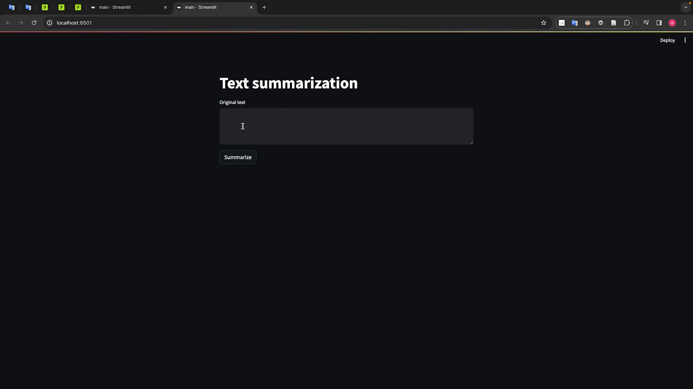

# Приложение создает краткое содержимое из текста на английском языке

Задание по дисциплине "Программная инженерия" магистратуры "Инженерия машинного обучения".

## Установка

`$ pip install -r requirements.txt`

## Запуск

`$ streamlit run main.py`

## Использование

1. Перейдите на страницу "http://localhost:8501/"
2. Введите текст, краткое содержимого которого вы хотите получить, в поле "Original text".
3. Нажмите кнопку "Summarize"
4. Получите сокращеный вариант текста в поле "Summary text"

## Пример работы

